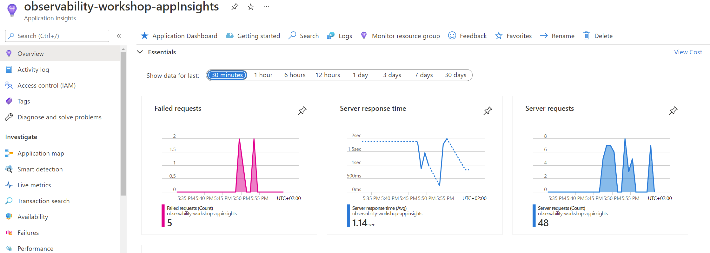
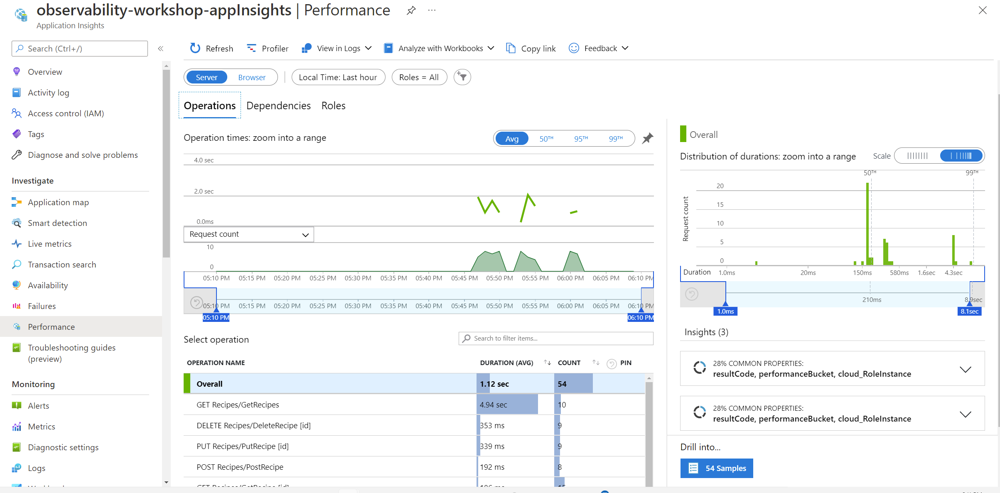
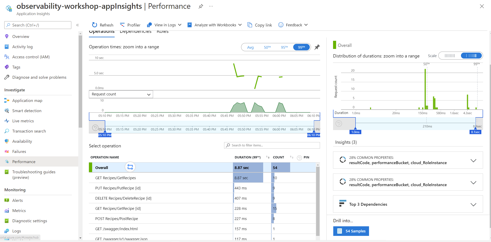
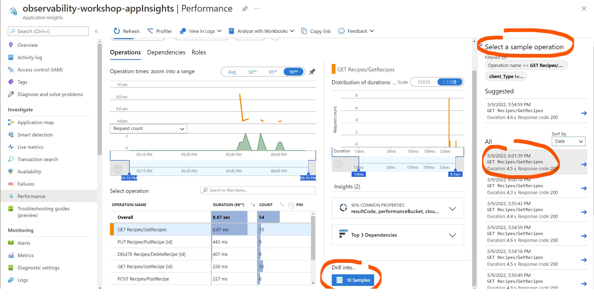
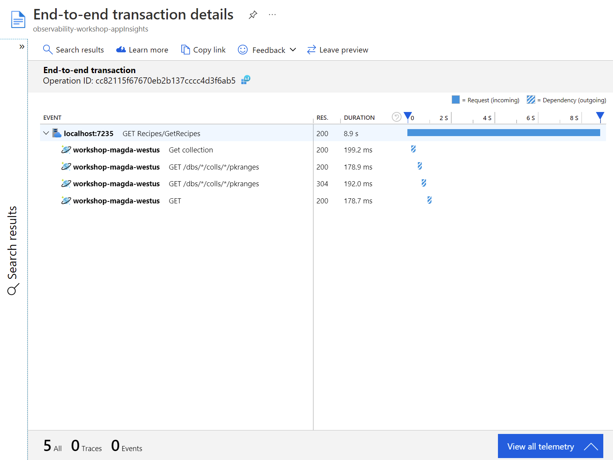
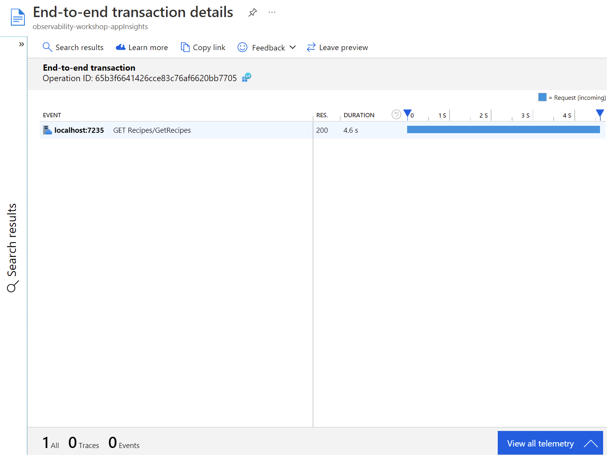

# Solution and tips for the challenge 1

In this challenge users will learn basics for troubleshooting Web APIs with Application Insights and/or logging locally.

## How the problem could be investigated?

1. Enable Application Insights
2. Generate some requests load (there will be a script that will do it automatically)
3. Start investigating in Application Insights
    1. Navigate to your Application Insights and check the Overview page. Check Server response time. It may suggest that the API response meets defined SLO
    
    2. Click on the Server response time chart. You should be redirected to Performance tab and see the following view:
    
    3. Notice that by default the chart shows aggregated duration calculated by average. To check if our defined SLO is met, change it to the 99th percentile. You should see that the duration is significantly higher and it doesn't meet SLO definition, which is 3 seconds for 99th of requests
    
    4. At the bottom part of the picture you can see different operations (endpoints calls) and there is a significant difference in their duration. `GET Recipes/GetRecipes` is the slowest request, so we should try to improve it. Other requests seem to be fast enough.
    5. Click on the `GET Recipes/GetRecipes` to view its duration and then click Drill into sample data. You can select any of the sample operation, but try to find the longest one. Each of them represents a single `GetRecipes` request
    
    6. If you selected the longest sample operation you should see similar End-to-end transaction view.
    
    This view shows that `GetRecipes` took 8.9s. As part of that request there were 4 outgoing calls (called dependencies) to Azure CosmosDb, but they happened at the beginning and they were very short (each of them took less then 200ms). So they are not responsible for making the request slow. Apart from that there is no more traces (log messages) or events associated with that transaction. Another example transaction looks like this:
    
    It shows that `GetRecipes` took 4.6s, and there weren't any calls to Azure CosmosDb and any other outgoing requests. That means that there must be something wrong in our `GetRecipes` code.
4. Have a look at the `RecipeController.cs` file and find `GetRecipes` method. You may already spot what the issue is. But before changing the code, let's enable more detailed logs. In the previous point we noticed that there are no logs associated with `GetRecipes` operation. However, our code should log one information level message. Let's have a look how logging is configured.
5. To be continued...

## Optional steps to do

* adding more logs and showing structured logging
* add custom instrumentation with telemetryClient and:

```dotnet
using var operation = _telemetryClient.StartOperation<DependencyTelemetry>("FindRecipe in DbContext");
```

## Learned skills

* How to enable Application Insights
* How to navigate in the Applications Insights
  * Overview
  * Performance
  * Drill to sample
  * End-to-end transaction view
  * Transaction Search
  * How requests, dependencies, traces are linked
* Log levels configuration, default log levels are seen by Application Insights

## Root cause of the problem

* Too many operations are done to get all recipes in `GetRecipes` endpoint. Current implementation takes first all ids of recipes, and then `dbContext` is called for each id to get all recipe details. In a single call we can get all these details:

```dotnet
await _context.Recipes.WithPartitionKey(_partitionKey).Select(r => new ResponseRecipeDTO(r)).ToListAsync();
```

* API is not paginated (with low number of recipes, that's not a problem and there is no need to fix it if the previous point was fixed)
